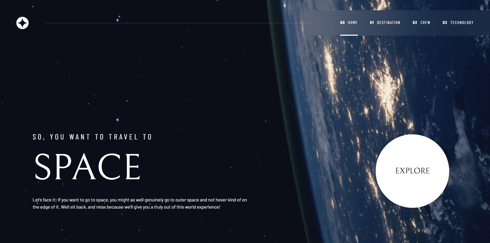

# Frontend Mentor - Space tourism website solution

This is a solution to the [Space tourism website challenge on Frontend Mentor](https://www.frontendmentor.io/challenges/space-tourism-multipage-website-gRWj1URZ3). Frontend Mentor challenges help you improve your coding skills by building realistic projects.

## Table of contents

- [Overview](#overview)
  - [The challenge](#the-challenge)
  - [Screenshot](#screenshot)
  - [Links](#links)
  - [Built with](#built-with)
- [Author](#author)

## Overview

### The challenge

Users should be able to:

- View the optimal layout for each of the website's pages depending on their device's screen size
- See hover states for all interactive elements on the page
- View each page and be able to toggle between the tabs to see new information

### Screenshot

### Links

- Solution URL: [Add solution URL here](https://www.frontendmentor.io/solutions/space-tourism-website---reactjs-0ilC0QBEQ-)
- Live Site URL: [Add live site URL here](https://space-tourism-website-vert-iota.vercel.app/)

## My process

### Built with

- [React](https://reactjs.org/) - JS library
- [TailwindCSS](https://tailwindcss.com/) - CSS library
- [Framer-motion](https://www.framer.com/motion/) - JS/React library
- [React-typed](https://www.npmjs.com/package/react-typed) - JS/React library
- [React-countup](https://www.npmjs.com/package/react-countup) - JS/React library

## Author

- Website - [Egondu](https://egonduihemebiri.vercel.app/)
- Frontend Mentor - [@ihemebiriegondu](https://www.frontendmentor.io/profile/ihemebiriegondu)
- Twitter - [@egondu_i](https://x.com/egondu_i?s=09)
